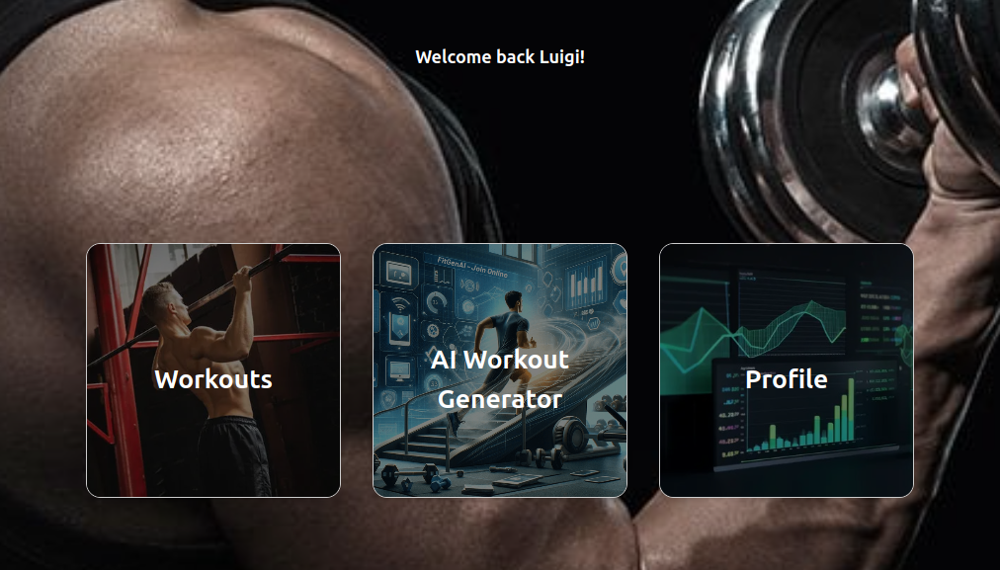
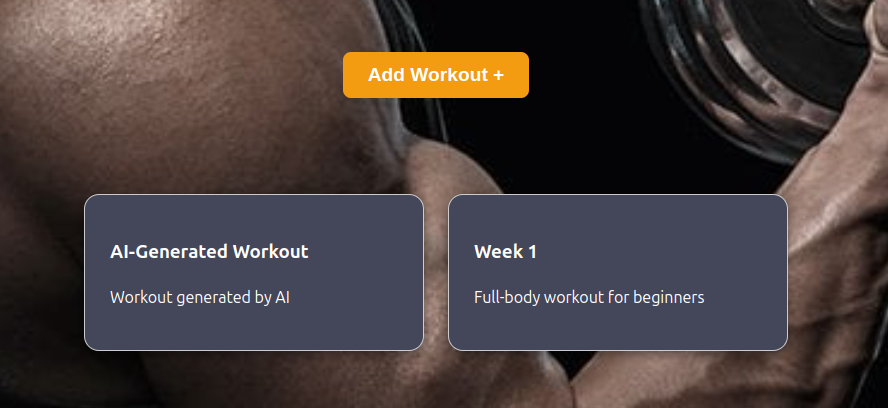
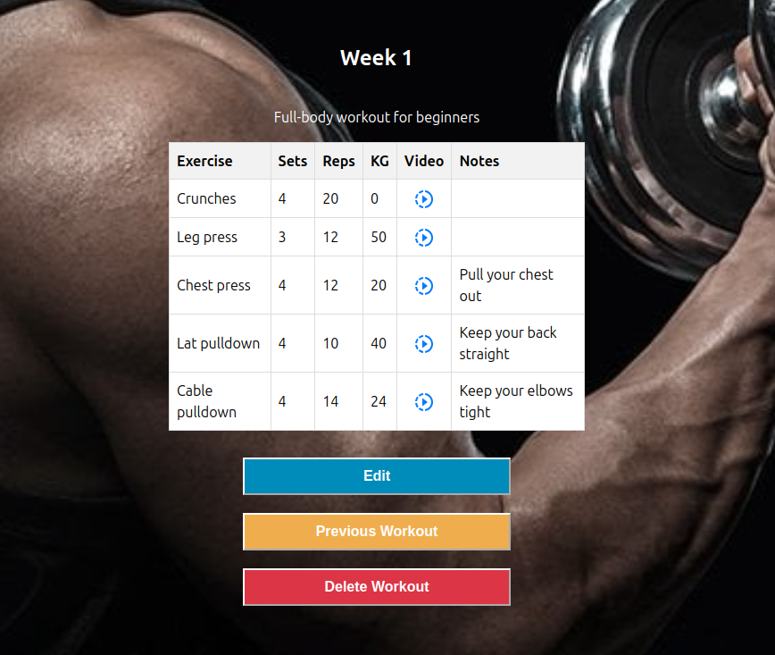
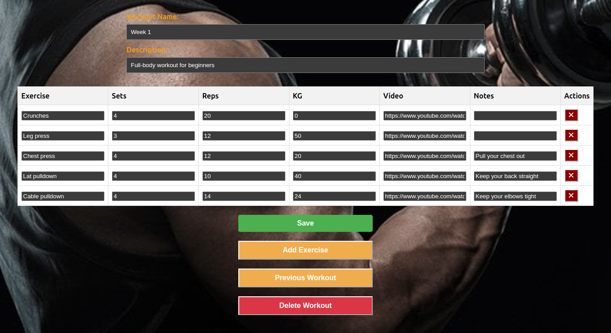
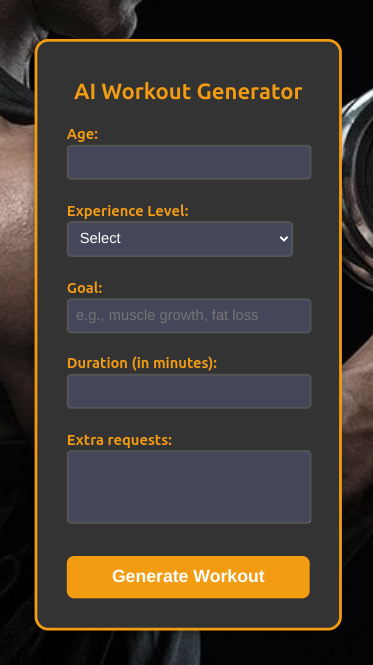
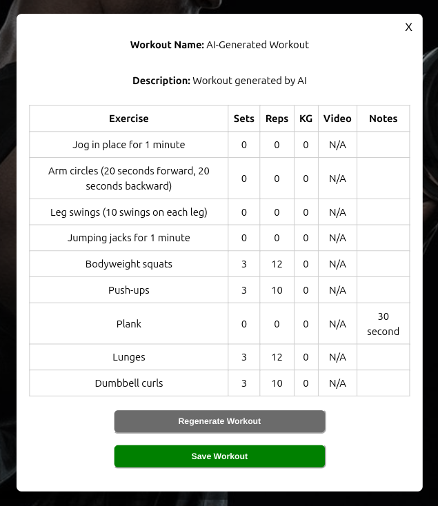
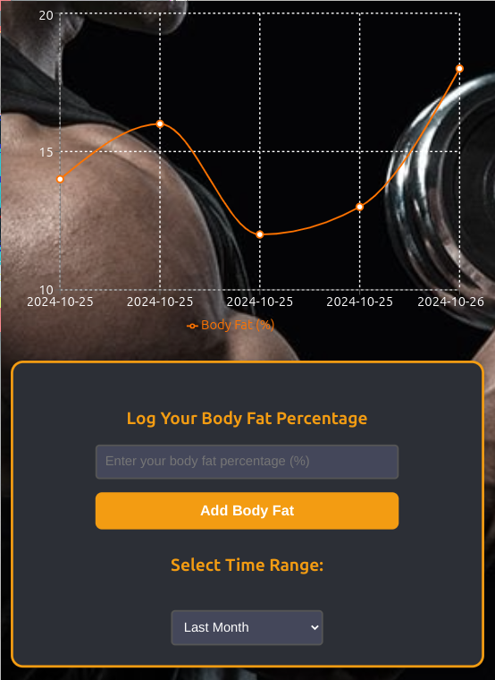

# FitLog

[Deployed Project](https://fitlog2-sigma.vercel.app/)

FitLog is a workout planning and tracking app designed to help you seamlessly manage and monitor your fitness progress. With a clean and straightforward interface, you can navigate through different sections to organize your workouts, generate new ones, and track your progress over time.

## Installation

1. **Install Dependencies**: At the root level, and then inside both the `client` and `server` directories, run:
   ```bash
   npm install
   ```
2. **Start the Client**: Navigate to the `client` directory and run:

   ```bash
   npm run dev
   ```

3. **Start the Server**: Navigate to the `server` directory and run:
   ```bash
   npx nodemon server
   ```

## Features

### 1. **User-Friendly Dashboard**

- The main dashboard welcomes you with an intuitive layout, allowing easy access to the core sections of the app:
  - **Workouts**
  - **AI Workout Generator**
  - **Profile**

### 2. **Workout Management**

- The **Workouts** section displays an overview of all your workouts.
- You can add new workouts or view existing ones to see detailed tables containing each exercise's data.
- Each exercise includes sets, reps, weight, video links, and notes for further guidance.

- **Editing and Customization**: Modify any workout or exercise directly in the table, with options to delete or add exercises as needed.

### 3. **AI Workout Generator**

- Generate personalized workout plans based on your specific requirements by using the AI Workout Generator.
- Input details like age, experience level, fitness goals, duration, and additional preferences to receive a customized workout suggestion.
- Save the generated workout to incorporate it into your routine.

### 4. **Profile & Progress Tracking**

- The **Profile** section provides visual tracking of your fitness stats, such as body fat percentage, with clear and informative graphs.
- You can log your body fat percentage and choose specific time ranges to monitor your progress effectively.

## Additional Features

- **Progressive Web App (PWA)**: FitLog is a fully responsive app that can be downloaded on your smartphone, allowing you to access and update your workout data directly from the gym.

## Screenshots

### 1. Main Dashboard



### 2. Workouts Overview



### 3. Workout Details



### 4. Workout Editing



### 5. AI Workout Generator



### 6. AI Generated Workout



### 7. Profile & Body Fat Tracking



---
